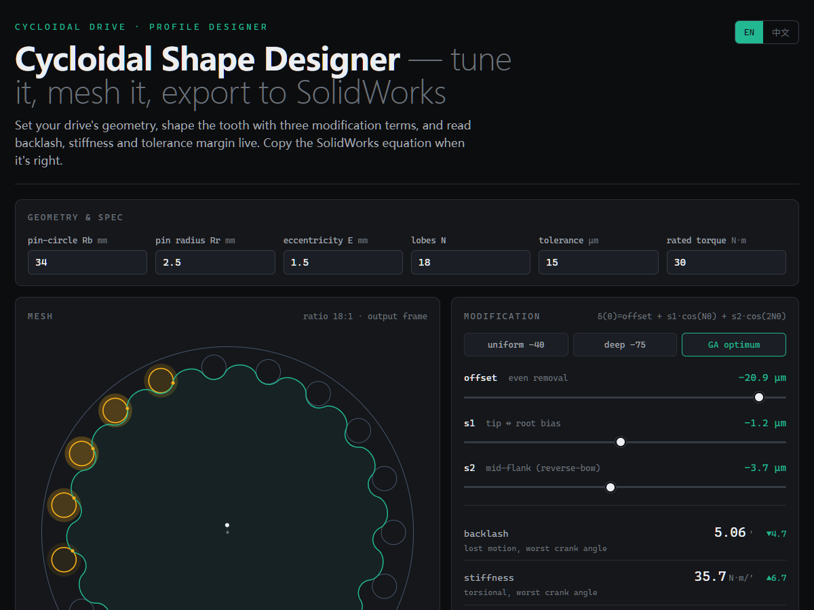

# 摆线工作室 Cycloidal Studio

**在浏览器里设计、优化、导出摆线针轮的齿廓修型。**

[](LICENSE)


*[English → README.md](README.md)*

摆线针轮减速器(RV 减速器、机器人关节里的那种)的成败,系于**齿廓修型**——几微米的去料量,决定了
背隙、刚度、丝滑度,以及计入加工公差后它到底能不能正常啮合。本项目把这个设计闭环做成了交互式:一个
自包含网页(内置多目标优化器)+ 一套复现文献基准的 Python 管线。

网页工具是**纯 HTML/JS/Canvas——无需构建、零依赖、无需服务器。** 直接打开文件,或两步部署到 GitHub Pages。



---

## 快速开始

- **在线演示:** **https://shkinsem.github.io/cycloidal-studio/** — 零安装,浏览器直接跑。
- **本地零安装:** 克隆仓库,浏览器打开 `index.html`。

---

## 工具 — `index.html`

调一颗齿,实时看整个减速器的响应:
- **可编辑几何与工况:** 针齿中心圆 Rb、针齿半径 Rr、偏心距 E、齿数 N、额定扭矩。
- **用"加工方案"取代抽象公差:** 选每个零件怎么做——摆线盘齿廓(磨齿/慢走丝/快走丝/铣/3D打印)、
  针齿销、销孔、偏心距——工具把每种工艺换算成 ±µm 误差源(懂行可直接改数值)。偏心距误差按有限差分
  算出的间隙灵敏度折算,不是拍脑袋按 1:1。
- **装机预测:** 对上述误差源做 400 次蒙特卡洛抽样,给出**你真正做出来的那批件**的背隙(典型–95%分位)
  和卡死率——改加工方案这个数立刻变,不像零误差理想背隙纹丝不动。
- **误差预算:** 每个来源对最坏背隙的贡献排序 + "先收紧哪个"提示——图纸上哪个标注真正换来弧分,一目了然。
- **修型** `δ(θ) = offset + Σₖ cₖ·cos(kNθ)`(4 阶谐波),滑块拖拽 + 预设。
- **目标驱动优化器:** 浏览器里的真 NSGA-II(Web Worker,无需 Python),按你的几何和加工方案搜索修型、
  自动载入最优解,并按**装机背隙**给判定:最坏也达标 / 95% 良率达标 / 达不到——附自校准的
  "总误差收到 ±X µm、先改 Y"建议。
- **啮合动画:** 偏心盘真的会转,受载齿发亮。
- **一键 SolidWorks 导出:** 复制方程驱动曲线 `X(t)` / `Y(t)`(数值内联),或下载点云 CSV。
- 全界面 **中 / EN** 切换。

---

## 它算什么

一个模型,产出文献里全部关心的量:

| 指标 | 含义 | 越好方向 |
|---|---|---|
| **背隙** | 零误差理想值,仅啮合 [arcmin] | 越小 |
| **装机背隙** | 蒙特卡洛:你真正做出来那批件的背隙 P50–P95 + 卡死率 | 越小 |
| **系统空回** | 啮合 + 输入轴承 + 输出机构间隙,折算到输出端 [arcmin] | 越小 |
| **扭转刚度** | 单位加载转角能扛的扭矩 [N·m/arcmin] | 越大 |
| **接触应力** | 受载针齿上的峰值赫兹线接触压力 [MPa] | 越小 |
| **安全系数** | 接触疲劳极限(≈1500 MPa)÷ 峰值接触应力 | 越大(>1 = 不失效) |
| **波动** | 一个啮合周期内负载传动误差的峰峰值 [µrad] | 越小 |
| **压力角** | 受载接触点 力向量与运动方向夹角 [deg] | 越小 |
| **最坏余量** | 所有加工误差同时取最紧时剩余的自由间隙 [arcmin] | 越大(>0 = 绝不卡死) |
| **误差预算** | 各误差源对最坏背隙的贡献排序 [arcmin] | —(告诉你先收紧哪个) |
| **可加工性** | 凹处最小曲率半径 vs 刀具半径 [mm] | 越大 |
| **受载齿数** | 分担额定扭矩的齿数 | 越多 |

---

## Python 管线(可选 — 用于对标)

网页工具不需要 Python。`optimizer/` 管线的用途是**对照文献验证物理模型**,并在更高分辨率下产出参考
前沿(网页里的预设就来自它的拐点设计):

```bash
pip install -r requirements.txt
cd optimizer

python test_model.py        # 快速自检
python benchmark.py         # 复现文献趋势 (5/5)
python optimize.py          # NSGA-II → results/pareto_front.csv (+ 图 + SolidWorks 方程)
python model.py             # 单个设计的分析图 → results/
```

`optimize.py` 跑真正的 **NSGA-II**(用 `pygad`,无冷门依赖),在 4 谐波齿廓
`δ(θ)=offset+Σₖ cₖ·cos(kNθ)` 上求 4 目标(背隙/刚度/波动/压力角)的帕累托前沿,带硬约束
(鲁棒余量 ≥ 0.5′、可加工、处处去料)。冒烟测试:`QUICK=1 python optimize.py`。

---

## 和论文对标

文献调研(见 git 历史)发现:所谓"用神经网络学最优齿廓"在本领域基本是误解——已发表的 ML 几乎都只是
**代理模型**,用来加速 FEA,外面照样套经典 GA/NSGA-II;设计自由度的突破来自**更丰富的几何参数化**,
而非神经网络。本项目正是这条路(富谐波 + NSGA-II + 加工鲁棒性),`benchmark.py` **5/5** 复现文献定性结论:

1. 修型降低峰值压力角(未修型 ≈85° → ≈55°)。
2. "反弓"修型在刚度和载荷分担上优于纯等距。
3. 受载齿数随扭矩上升(弹性载荷扩散)。
4. 背隙与公差余量单调权衡。
5. 加工误差侵蚀余量——名义最优会卡死,鲁棒设计不会。

物理为准静态、刚性盘、线性化接触——趋势可靠,绝对值为量级估计。要论文级绝对数值,下一步是加载齿接触/FEA。

---

## 部署到 GitHub Pages

静态站点,部署极简。二选一:

**A. 自动(已含工作流)。** 推送到 `main`,`.github/workflows/pages.yml` 会自动发布。
只需启用一次:**Settings → Pages → Build and deployment → Source: GitHub Actions**。

**B. 零配置。** **Settings → Pages → Deploy from a branch → `main` / root**。

站点地址 `https://<你的用户名>.github.io/<仓库名>/`。

---

## 项目结构

```
index.html              # 工具本体: 设计器 + 实时鲁棒优化器 (打开这个)
pareto.html             # 旧地址 — 重定向到 index.html
optimizer/
  model.py              # 物理核心: 啮合/背隙/刚度/波动/余量 (已验证)
  objectives.py         # K 谐波齿廓 + 压力角/可加工性/鲁棒性
  optimize.py           # NSGA-II 多目标 → 帕累托前沿
  benchmark.py          # 复现文献趋势 (5/5)
  test_model.py         # 单元自检
  results/              # pareto_front.csv (已提交的参考前沿; 图/txt 可再生, 已 gitignore)
assets/                 # README 用到的截图
cad/                    # 参考 SolidWorks 零件
requirements.txt        # numpy, matplotlib, pygad (仅优化器需要)
```

---

## 参与贡献

欢迎 Issue 和 PR——本项目就是拿来折腾的。好的切入方向: 更高保真的加载齿接触物理、样条/NURBS 参数化选项、
导出到其他 CAD 格式、或比均匀最坏情况更精细的逐谐波加工误差模型。

---

## 许可

MIT,见 [LICENSE](LICENSE)。为 RoboMaster 社区与摆线传动爱好者而作。
